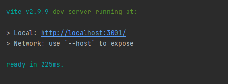

# Talkative Chat Widget Autostart with Interaction Data

Talkative offers an interaction scheduling system, but in some cases you might want to be able to direct a user
to webpage and have the chat start automatically. You might also wish to pass interaction data to engage which
is created from a query string passed with the URL, for example campaign details should the link be from an email 
campaign. This is all possible using our front end API.

## Disclaimer

The included examples are examples and should not be copied into your production environment without first modifying it
for your use case. 

## Feature Demo Video

[Feature Demo Video](assets/instant-start-interaction.mp4)

## Prerequisites

You will need the config UUID for the chosen chat widget.


Update the config UUID in the main.js file and the example should be ready to run.

## Installation

The examples are built using Vite which has its own web server to test locally. The example also uses tailwind to 
provide some basic styling for presentation. Neither of these are requirements for your production environment, and
you can build your widget icon using your preferred stack.

Firstly, install the dependencies

```bash
npm i
```

Then run the development server

```bash
npm run dev
```

The output will let you know what URL to load.



If you load this URL with no query string, no interaction will be passed to Engage. The code example is expecting query
parameters of foo and bar `?foo=foodata&bar=bardata` - appending this query string to the URL will mean the code
will detect, parse and send this data as interaction data to Engage.

When you load the URL, the interaction will start automatically. If you have a pre-interaction data collection form 
configured, this will be loaded before the interactions starts, if not, the interaction will begin and search for an
agent straight away.


