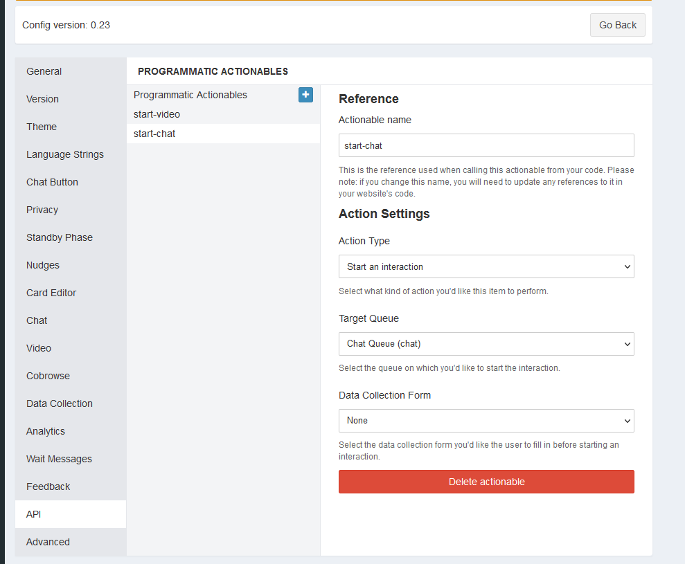
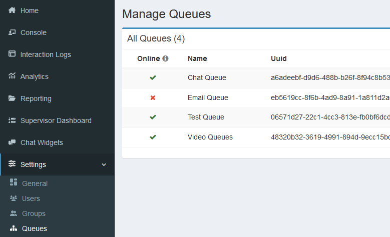
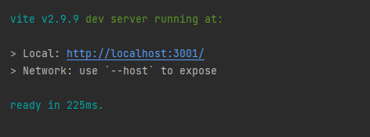
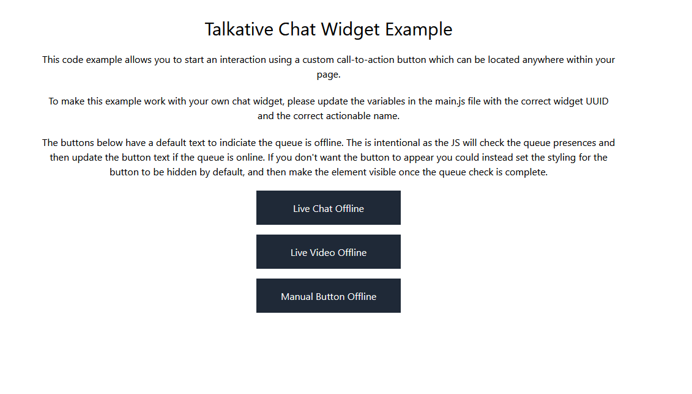

# Talkative Chat Widget Custom CTA Button Example

The Talkative chat widget API allow you to create your own custom CTA buttons. The API provides a way of checking
the queue the button will point to is online, so you can easily customise the appearance of the button to make it 
clear if the queue is available and ready to accept interactions.

## Disclaimer

The included examples are examples and should not be copied into your production environment without first modifying it
for your use case. 

## Prerequisites

To test this example, you will need to set up two programmatic actions in your chat widget config. One called `start-chat`
and another called `start-video`. These should be configured to start an interaction in the appropriate queues. 




You will also need to take note of the queue UUIDs related to these actions. These can be retrieved from the queue page 
in the Talkative Dashboard. 



Finally, you will need the config UUID for the chosen chat widget.


Update the config UUID and the queue UUIDs in the main.js file and the example should be ready to run.

## Installation

The examples are built using Vite which has its own web server to test locally. The example also uses tailwind to 
provide some basic styling for presentation. Neither of these are requirements for your production environment, and
you can build your CTA using your preferred stack.

Firstly, install the dependencies

```bash
npm i
```

Then run the development server

```bash
npm run dev
```

The output will let you know what URL to load




Once loaded, you should see a page similar to this one:



Depending on what queues you pointed your buttons too, the buttons will likely state the queue is offline. In Talkative
make sure there is an agent available in the queues. Once this is done, wait 90 seconds, then refresh your page 
and the button should update to indicate the queue is online. In addition to this, the event handlers will now be 
registered and clicking the button should trigger an interaction to start in the correct queue.

> Please note, we cache our presences for up to 1 minute, which means there will be a delay between the agent going 
> online in the queue and the chat widget presences updating. Please wait 90 seconds, before refreshing the page
> to get a fresh presence from the system.
