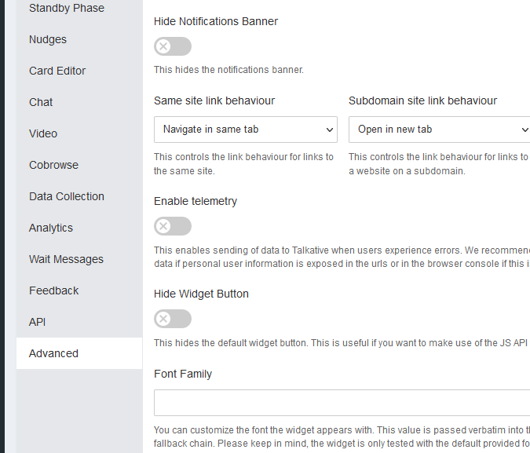
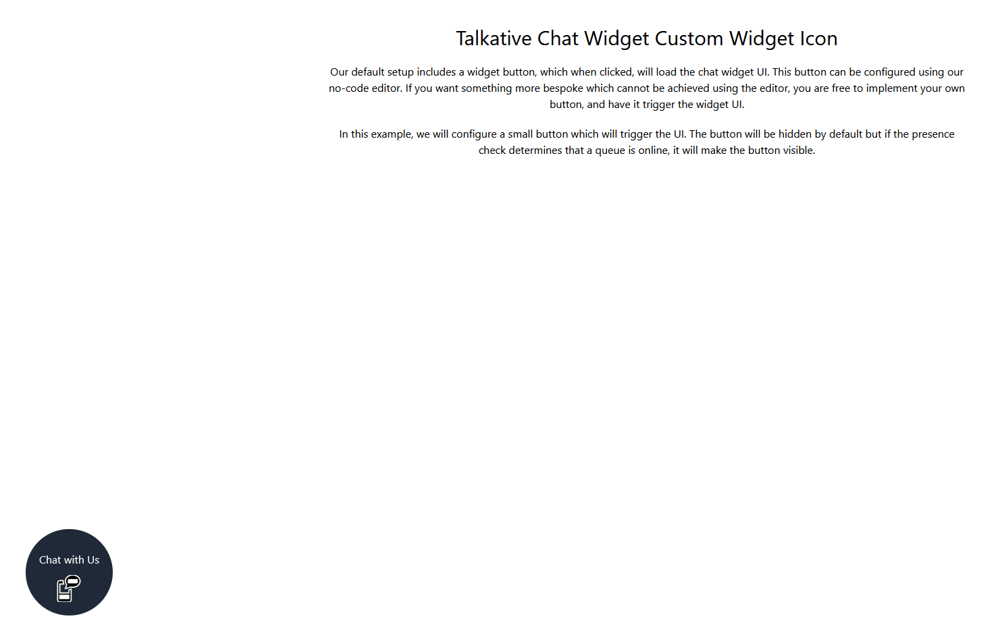

# Talkative Chat Widget Custom Widget Icon

The Talkative chat widget features a no code editor where you can customise your chat widget icon, however, in some 
instances you may wish to have something more bespoke. This example show you a method of implementing a custom chat icon.

## Disclaimer

The included examples are examples and should not be copied into your production environment without first modifying it
for your use case. 

## Prerequisites

To test this example, you will need to disable the default chat widget icon in your config editor.



Finally, you will need the config UUID for the chosen chat widget.


Update the config UUID in the main.js file and the example should be ready to run.

## Installation

The examples are built using Vite which has its own web server to test locally. The example also uses tailwind to 
provide some basic styling for presentation. Neither of these are requirements for your production environment, and
you can build your widget icon using your preferred stack.

Firstly, install the dependencies

```bash
npm i
```

Then run the development server

```bash
npm run dev
```

The output will let you know what URL to load


Once loaded, you should see a page similar to this one:



The icon should now appear in the bottom left corner of the screen. If you click the icon, the UI will appear and the
icon will disappear. Minimizing the UI will again re-enable the chat icon.

> Please note, we cache our presences for up to 1 minute, which means there will be a delay between the agent going 
> online in the queue and the chat widget presences updating. Please wait 90 seconds, before refreshing the page
> to get a fresh presence from the system.
