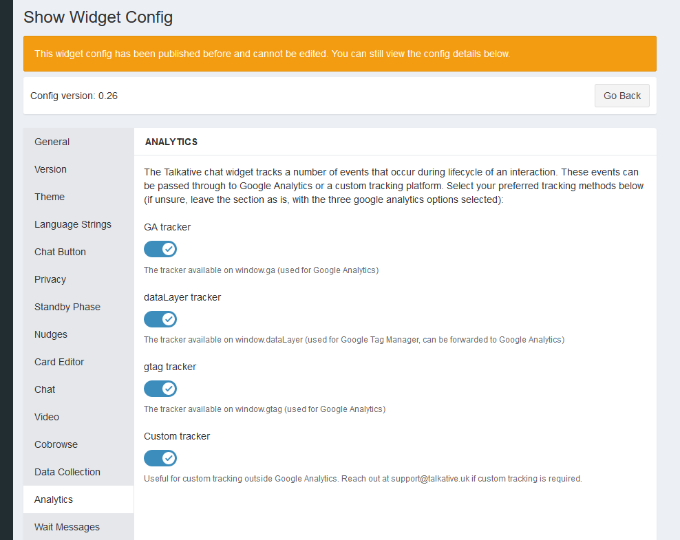

# Talkative Chat Widget Custom Tracking

The talkative chat widget integrates with Google Analytics by default, however, if you wish to use a different
	tracking solution or even send events to another solution, you can do so with our custom callback solution.

## Disclaimer

The included examples are examples and should not be copied into your production environment without first modifying it
for your use case. 

## Prerequisites

You will need the config UUID for the chosen chat widget.


Update the config UUID in the main.js file and the example should be ready to run.

## Installation

The examples are built using Vite which has its own web server to test locally. The example also uses tailwind to 
provide some basic styling for presentation. Neither of these are requirements for your production environment, and
you can build your widget icon using your preferred stack.

Firstly, install the dependencies

```bash
npm i
```

Then run the development server

```bash
npm run dev
```

The output will let you know what URL to load.


Make sure you have enabled the custom tracking option in the analytics configuration tab of your chat widget.



This test will send events to the `window.gtag` function that we have defined to simulate Google Analytics. You can
change this to send events to your own tracking solution.
