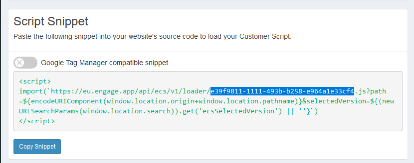
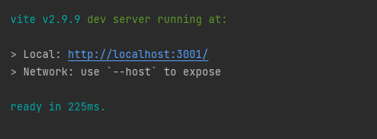

# Talkative Chat Widget Events Example

The Talkative Chat widget fires various events during the lifecycle of the widget. These events can be used to
trigger actions in your own code, or to send data to Engage to be used in the interaction.

This repository contains a simple example of how to listen for these events and register a callback.

## Disclaimer

The included examples are examples and should not be copied into your production environment without first modifying it
for your use case. 

## Prerequisites

You will need the config UUID for the chosen chat widget.



Update the config UUID in the main.js file and the example should be ready to run.

## Installation

The examples are built using Vite which has its own web server to test locally. The example also uses tailwind to 
provide some basic styling for presentation. Neither of these are requirements for your production environment, and
you can build your widget icon using your preferred stack.

Firstly, install the dependencies

```bash
npm i
```

Then run the development server

```bash
npm run dev
```

The output will let you know what URL to load.



If you open your browser web tools. You should see the corresponding events being logged to the console.
