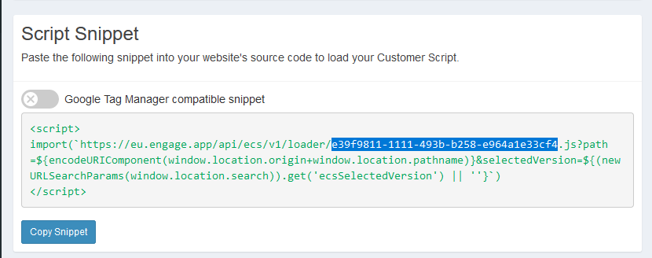

# Talkative Chat Widget with Interaction Data Injected via API

Talkative offers a pre-interaction data collection form to collect customer data. In some cases, the widget might
appear on a part of a website where the user has already logged in. In this case, the pre-interaction form is not
required, and the data can be passed to the widget via the API. If you still wish to use the pre-interaction form,
you can still pass the data to the widget via the API, and it will be used to pre-populate the form.

## Disclaimer

The included examples are examples and should not be copied into your production environment without first modifying it
for your use case. 

## Prerequisites

You will need the config UUID for the chosen chat widget.



Update the config UUID and region in the main.js file and the example should be ready to run.

## Installation

The examples are built using Vite which has its own web server to test locally. The example also uses tailwind to 
provide some basic styling for presentation. Neither of these are requirements for your production environment, and
you can build your widget icon using your preferred stack.

Firstly, install the dependencies

```bash
npm i
```

Then run the development server

```bash
npm run dev
```

The output will let you know what URL to load.


